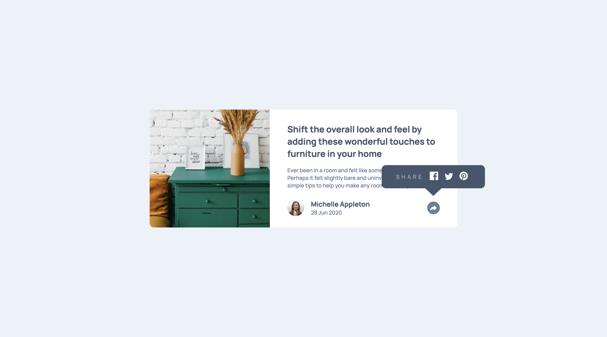
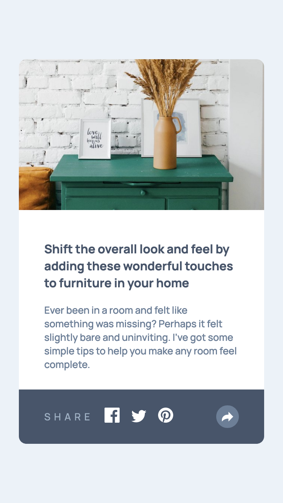

# Frontend Mentor - Article preview component solution

This is a solution to the [Article preview component challenge on Frontend Mentor](https://www.frontendmentor.io/challenges/article-preview-component-dYBN_pYFT). Frontend Mentor challenges help you improve your coding skills by building realistic projects. 

## Table of contents

- [Overview](#overview)
  - [The challenge](#the-challenge)
  - [Screenshot](#screenshot)
  - [Links](#links)
- [My process](#my-process)
  - [Built with](#built-with)
  - [What I learned](#what-i-learned)
  - [Continued development](#continued-development)
  - [Useful resources](#useful-resources)
- [Author](#author)
- [Acknowledgements](#acknowledgements)


## Overview

### The challenge

Users should be able to:

- View the optimal layout for the component depending on their device's screen size
- See the social media share links when they click the share icon

### Screenshot




### Links

- Solution URL: [Github](https://github.com/erelita/articlepreview_componentmaster.git)
- Live Site URL: [Netlify](https://article-preview-compmas-byer.netlify.app)

## My process

### Built with

- Semantic HTML5 markup
- CSS custom properties
- Flexbox
- CSS Grid
- Mobile-first workflow
- Javascript

### What I learned

Wow! Where to begin? This is my first challenge using javascript and, boy, it didn't disappoint. I realized I have opened a lot of tabs looking for a way to change the tooltip based on the size of the screen.

The first thing I did was to finish the HTML and CSS of the challenge without the tooltip. Thankfully, I did 2 or 3 challenges before this and I did fine (I think) with the HTML and CSS part.

Instead of using  for the share icon, I used its <svg>, so I can change its color when it's clicked.

```html
<div id="share-icon" class="grey-fill icon-bg">
  <svg xmlns="http://www.w3.org/2000/svg" width="15" height="13"><path d="M15 6.495L8.766.014V3.88H7.441C3.33 3.88 0 7.039 0 10.936v2.049l.589-.612C2.59 10.294 5.422 9.11 8.39 9.11h.375v3.867L15 6.495z"/></svg>
</div>
```
```css

.icon-bg {
    background-color: var(--clr-p);
}

.fill path {
    fill: #fff;
}
```
```js
shareIcon.classList.toggle('fill');
shareIcon.classList.toggle('icon-bg');
```

Instead of using matchMedia() to hide and show the tooltip, I changed it to using opacity with the help of transition.


### Continued development

I used two tooltips for the mobile and desktop version. The most challenging part was the integrating the mediaquery with javascript. I got it working (thanks to the wonderful tutorials I've seen online), but it's not responsive enough. Sometimes the js works with respect to the width, sometimes it doesn't. Will probably go back here once I knew more about javascript and I'll fix this :)

### Useful resources

- [MDN](https://developer.mozilla.org/en-US/docs/Web/API/Window/matchMedia) - Explored matchMedia() here. Very helpful.
- [Kinsta](https://kinsta.com/blog/javascript-media-query/#why-is-responsive-design-important) - Helpful blog post from Kinsta.


## Author

- Github - [Erelita](https://github.com/erelita)
- Frontend Mentor - [@erelita](https://www.frontendmentor.io/profile/erelita)

## Acknowledgements

The first version I posted was messy. It didn't function properly because of the matchMedia(). Reviewed and revised my HTML, CSS and JS files thanks to [Thiago Santos](https://www.frontendmentor.io/profile/thiago-hds). Learned a lot more while revising my code :)